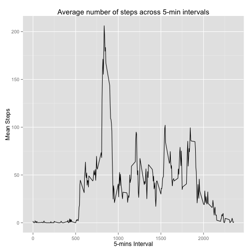
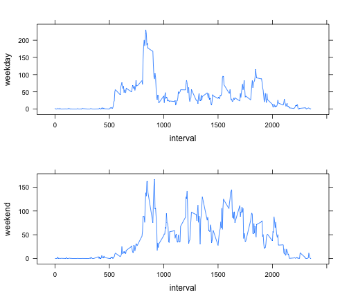

Analyzing Personal Movement by Users of Activity Monitoring Devices
===================================================================


```r
library(plyr)
library(chron)
library(ggplot2)
require(lattice)
```

```
## Loading required package: lattice
```

```r
library(gridExtra)
```

```
## Loading required package: grid
```

```r
df <- read.csv("activity.csv")

df$date <-as.Date(df$date,"%Y-%m-%d")

by_day <- ddply(df, .(format(date, "%m-%d")), summarize, total=sum(steps, na.rm=TRUE), mean=mean(steps, na.rm=TRUE))

colnames(by_day) <- c("Date", "Total", "Mean")

by_day <- na.omit(by_day)
```

# Histogram of total steps taken each day


```r
hist(by_day$Total, xlab="Steps", main="Histogram of total steps taken each day")
```

 

## Mean and median of total steps by day


```r
mean(by_day$Total)
```

```
## [1] 10766
```

```r
median(by_day$Total)
```

```
## [1] 10765
```

## Average daily activity pattern?


```r
by_five_mins <- ddply(df, .(interval), summarize, mean=mean(steps, na.rm=TRUE))

qplot(interval, mean, data=by_five_mins, geom="line", xlab="5-mins Interval", ylab="Mean Steps", main="Average number of steps across 5-min intervals")
```

 

## Maximum steps interval


```r
rw <- which.max(by_five_mins$mean)

by_five_mins$interval[rw]
```

```
## [1] 835
```

## Adjust for NA values


```r
# How many NAs are there?

navalues <- apply(df, 2, function(x) length(which(is.na(x))))
```

###There are 2304 NA rows in the original activity data.

###Use mean for the day as number for missing data


```r
df2 <- df

replace_mean <- function(x) replace(x, is.na(x), mean(x, na.rm = TRUE))

df3 <- ddply(df2, ~ interval, transform, steps = replace_mean(steps))
```

## Histogram of total steps taken each day with missing data filled in


```r
by_day_filled <- ddply(df3, .(format(date, "%m-%d")), summarize, total=sum(steps, na.rm=TRUE), mean=mean(steps, na.rm=TRUE))

colnames(by_day_filled) <- c("Date", "Total", "Mean")

hist(by_day_filled$Total, xlab="Steps", main="Histogram of total steps taken each day")
```

 

## Mean and median of total steps by day with missing data filled in


```r
mean(by_day_filled$Total)
```

```
## [1] 10766
```

```r
median(by_day_filled$Total)
```

```
## [1] 10766
```


```r
df3$day <- weekdays(as.Date(df3$date))

five_min_weekend <- df3[which(df3$day=="Saturday" | df3$day=="Sunday"),]

by_five_min_both <- ddply(five_min_weekend, .(interval), summarize, weekend=mean(steps, na.rm=TRUE))


five_min_weekday <- df3[which(df3$day!="Saturday" & df3$day!="Sunday"),]

by_five_min_weekday <- ddply(five_min_weekday, .(interval), summarize, mean=mean(steps, na.rm=TRUE))

by_five_min_both$weekday <- by_five_min_weekday$mean

plot1 <- xyplot(weekday ~ interval, data=by_five_min_both, type="l")
plot2 <- xyplot(weekend ~ interval, data=by_five_min_both, type="l")
grid.arrange(plot1,plot2, nrow=2)
```

 
